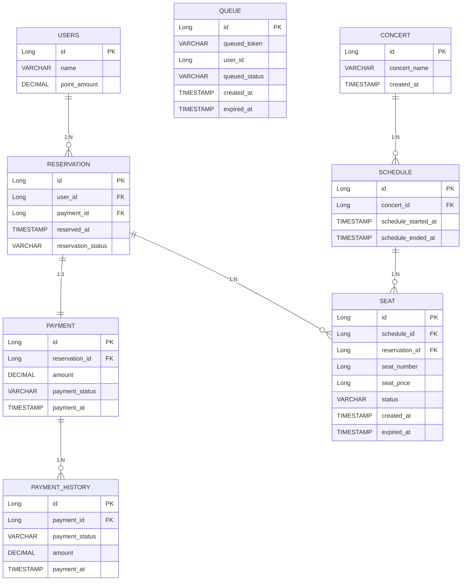

# ERD 설계

---

```mermaid
erDiagram
    USERS {
        Long id PK
        VARCHAR name
        DECIMAL point_amount
    }

    QUEUE {
        Long id PK
        VARCHAR queued_token
        Long user_id
        VARCHAR queued_status
        TIMESTAMP created_at
        TIMESTAMP expired_at
    }

    RESERVATION {
        Long id PK
        Long user_id FK
        Long payment_id FK
        TIMESTAMP reserved_at
        VARCHAR reservation_status
    }

    PAYMENT {
        Long id PK
        Long reservation_id FK
        DECIMAL amount
        VARCHAR payment_status
        TIMESTAMP payment_at
    }
    
    PAYMENT_HISTORY {
        Long id PK
        Long payment_id FK
        VARCHAR payment_status
        DECIMAL amount
        TIMESTAMP payment_at
    }
    
    CONCERT {
        Long id PK
        VARCHAR concert_name
        TIMESTAMP created_at
    }

    SCHEDULE {
        Long id PK
        Long concert_id FK
        TIMESTAMP schedule_started_at
        TIMESTAMP schedule_ended_at
    }
    
    SEAT {
        Long id PK
        Long schedule_id FK
        Long reservation_id FK
        Long seat_number
        Long seat_price
        VARCHAR status
        TIMESTAMP created_at
        TIMESTAMP expired_at
    }

    %% Relationships
    USERS ||--o{ RESERVATION : "1:N"
    RESERVATION ||--|| PAYMENT : "1:1"
    PAYMENT ||--o{ PAYMENT_HISTORY : "1:N"
    RESERVATION ||--o{ SEAT : "1:N"
    CONCERT ||--o{ SCHEDULE : "1:N"
    SCHEDULE ||--o{ SEAT : "1:N"

```