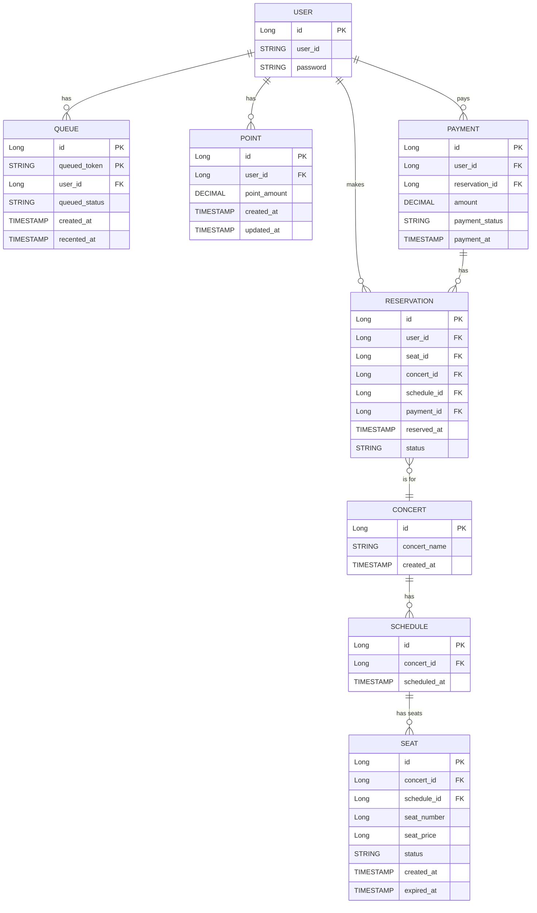

# ERD 설계

---

```mermaid
erDiagram
    USER {
        Long id PK
        STRING user_id
        STRING password
    }

    QUEUE {
        Long id PK
        STRING queued_token PK
        Long user_id FK
        STRING queued_status
        TIMESTAMP created_at
        TIMESTAMP recented_at
    }

    POINT {
        Long id PK
        Long user_id FK
        DECIMAL point_amount
        TIMESTAMP created_at
        TIMESTAMP updated_at
    }

    RESERVATION {
        Long id PK
        Long user_id FK
        Long seat_id FK
        Long concert_id FK
        Long schedule_id FK
        Long payment_id FK
        TIMESTAMP reserved_at
        STRING status
    }

    PAYMENT {
        Long id PK
        Long user_id FK
        Long reservation_id FK
        DECIMAL amount
        STRING payment_status
        TIMESTAMP payment_at
    }

    CONCERT {
        Long id PK
        STRING concert_name
        TIMESTAMP created_at
    }

    SCHEDULE {
        Long id PK
        Long concert_id FK
        TIMESTAMP scheduled_at
    }

    SEAT {
        Long id PK
        Long concert_id FK
        Long schedule_id FK
        Long seat_number
        Long seat_price
        STRING status
        TIMESTAMP created_at
        TIMESTAMP expired_at
    }

    %% Relationships
    USER ||--o{ QUEUE : "has"
    USER ||--o{ POINT : "has"
    USER ||--o{ RESERVATION : "makes"
    USER ||--o{ PAYMENT : "pays"
    PAYMENT ||--o{ RESERVATION : "has"
    RESERVATION }o--|| CONCERT : "is for"
    CONCERT ||--o{ SCHEDULE : "has"
    SCHEDULE ||--o{ SEAT : "has seats"

```