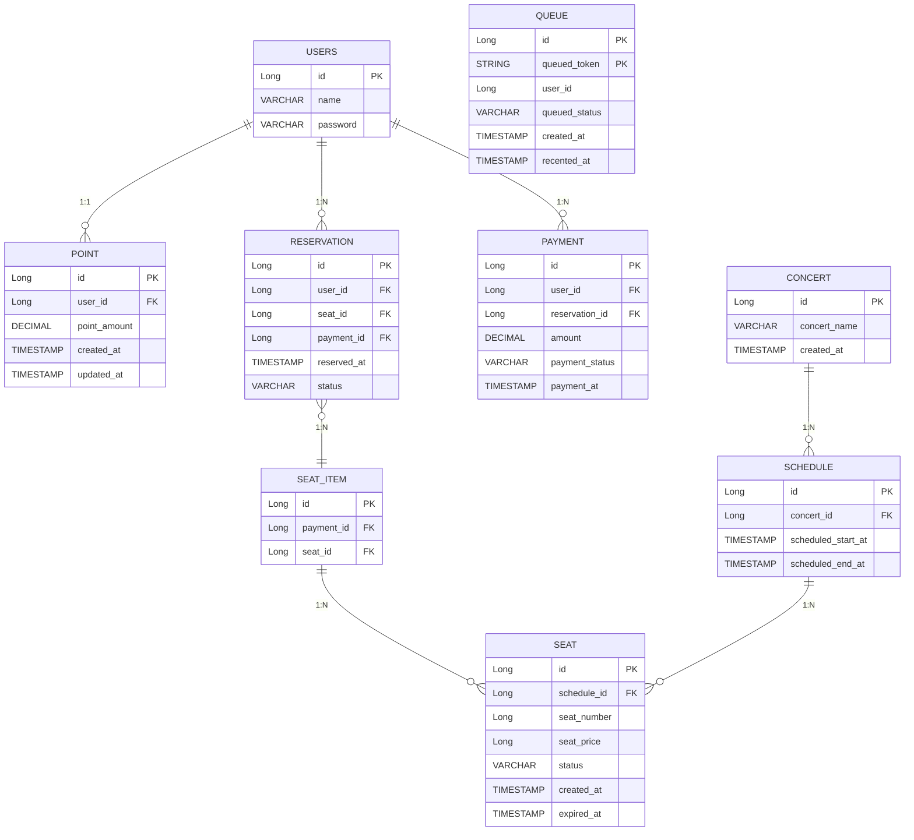

# ERD 설계

---

```mermaid
erDiagram
    USERS {
        Long id PK
        VARCHAR name
        VARCHAR password
    }

    QUEUE {
        Long id PK
        STRING queued_token PK
        Long user_id
        VARCHAR queued_status
        TIMESTAMP created_at
        TIMESTAMP recented_at
    }

    POINT {
        Long id PK
        Long user_id FK
        DECIMAL point_amount
        TIMESTAMP created_at
        TIMESTAMP updated_at
    }

    RESERVATION {
        Long id PK
        Long user_id FK
        Long seat_id FK
%%        Long concert_id FK
%%        Long schedule_id FK
        Long payment_id FK
        TIMESTAMP reserved_at
        VARCHAR status
    }

    PAYMENT {
        Long id PK
        Long user_id FK
        Long reservation_id FK
        DECIMAL amount
        VARCHAR payment_status
        TIMESTAMP payment_at
    }

    CONCERT {
        Long id PK
        VARCHAR concert_name
        TIMESTAMP created_at
    }

    SCHEDULE {
        Long id PK
        Long concert_id FK
        TIMESTAMP scheduled_start_at
        TIMESTAMP scheduled_end_at
    }
    
    SEAT_ITEM {
        Long id PK
        Long payment_id FK
        Long seat_id FK
    }
    
    SEAT {
        Long id PK
        Long schedule_id FK
        Long seat_number
        Long seat_price
        VARCHAR status
        TIMESTAMP created_at
        TIMESTAMP expired_at
    }

    %% Relationships
    USERS ||--o{ POINT : "1:1"
    USERS ||--o{ RESERVATION : "1:N"
    USERS ||--o{ PAYMENT : "1:N"
    RESERVATION }o--|| SEAT_ITEM : "1:N"
    SEAT_ITEM ||--o{ SEAT : "1:N"
    CONCERT ||--o{ SCHEDULE : "1:N"
    SCHEDULE ||--o{ SEAT : "1:N"

```