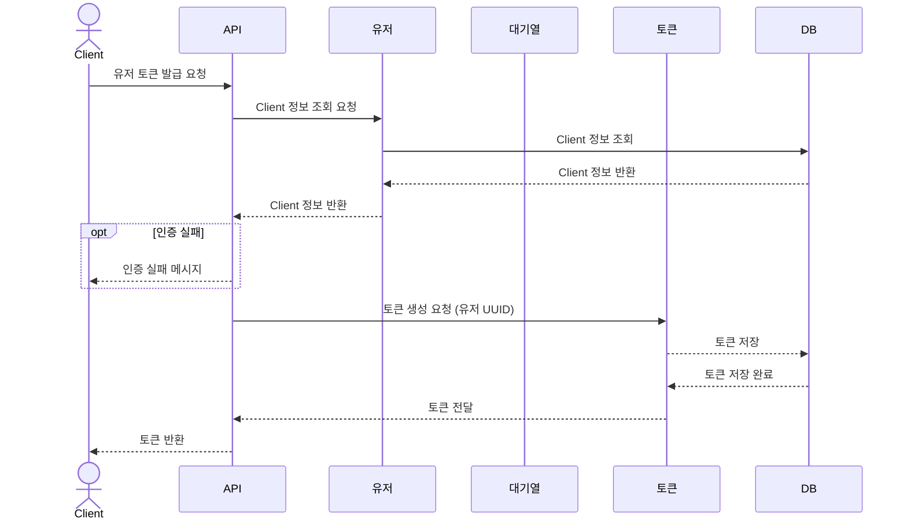
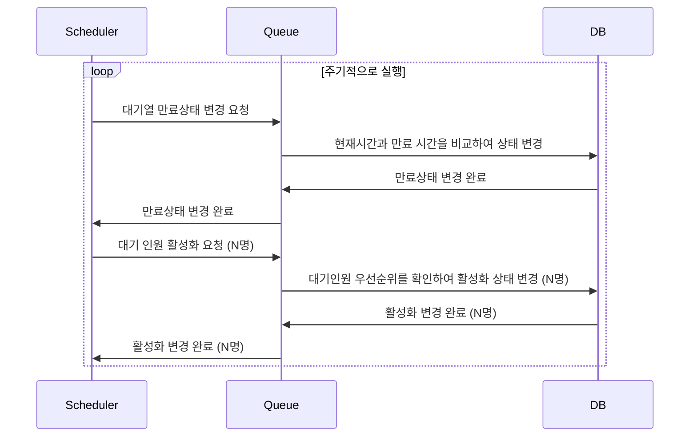
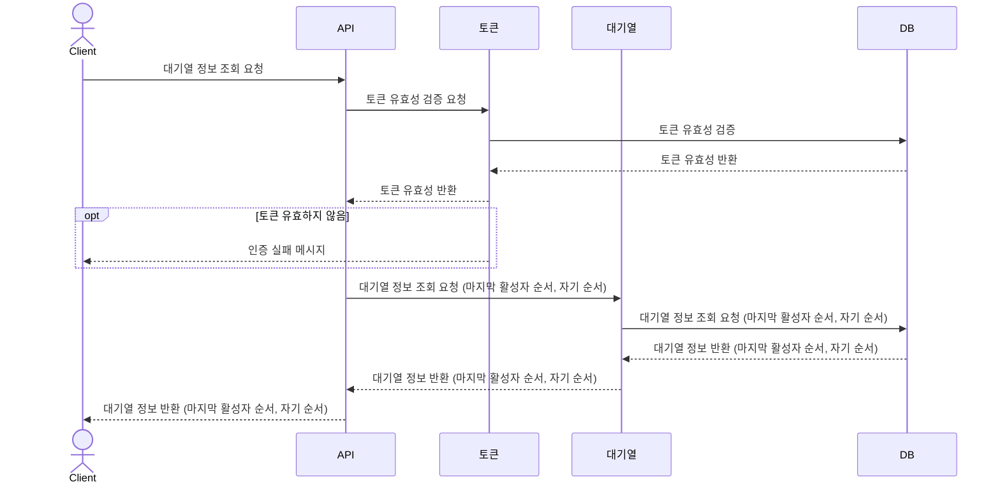
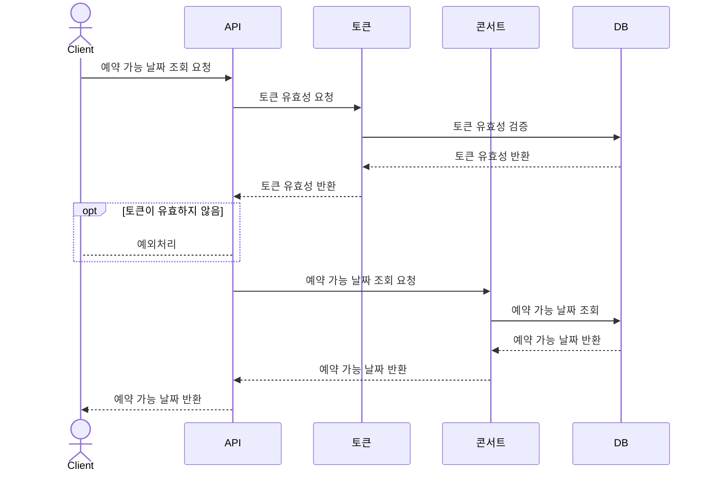
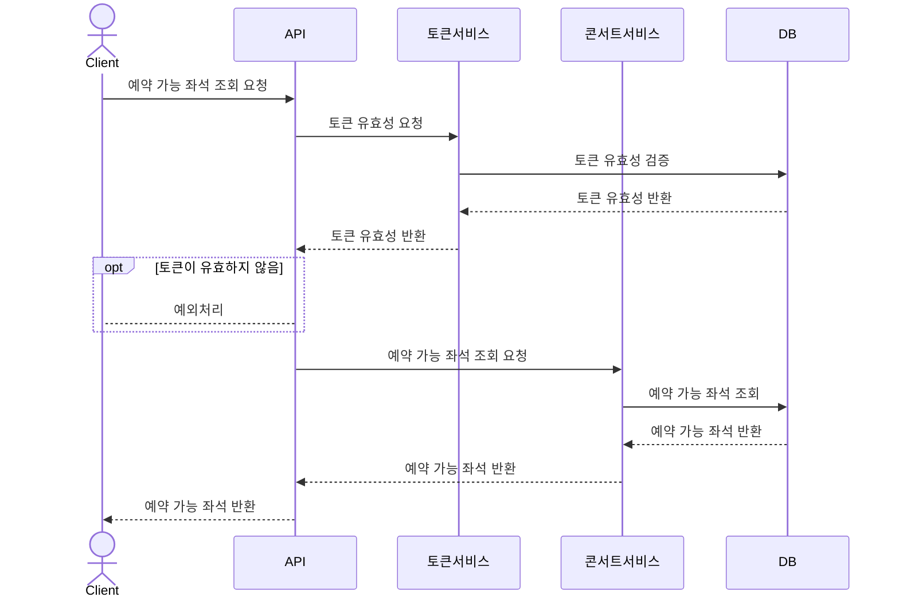
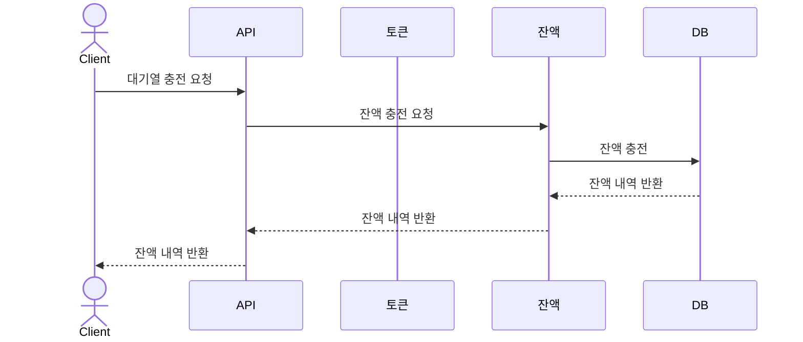
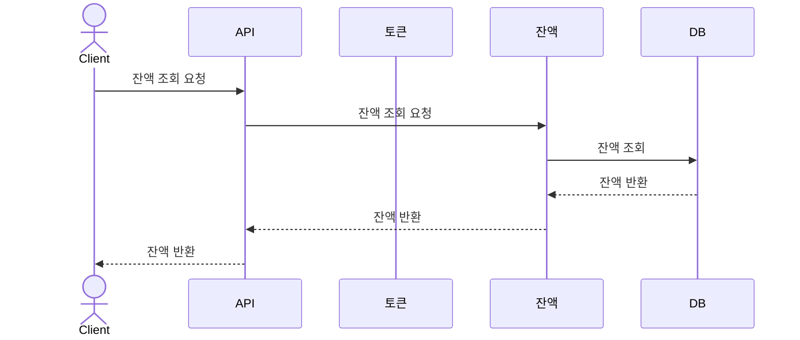
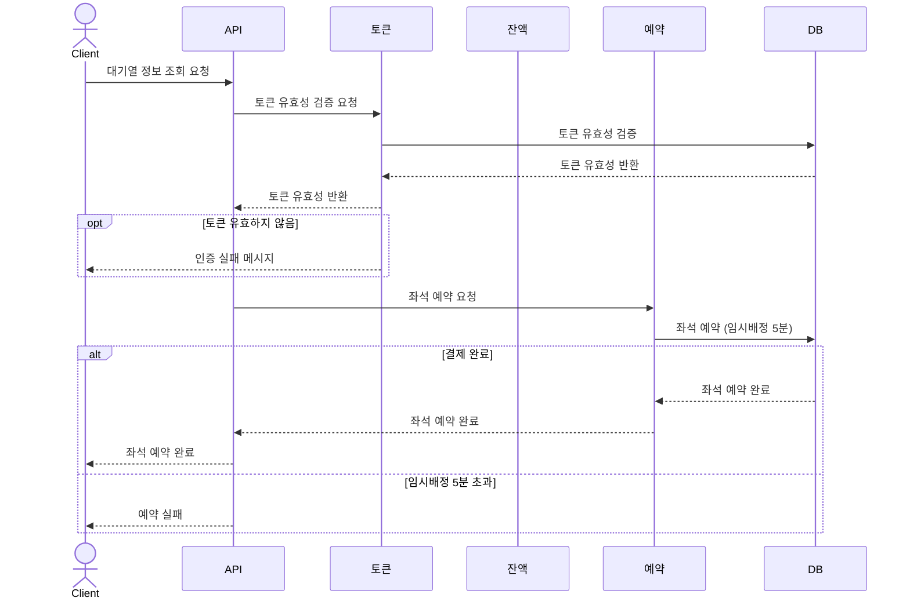
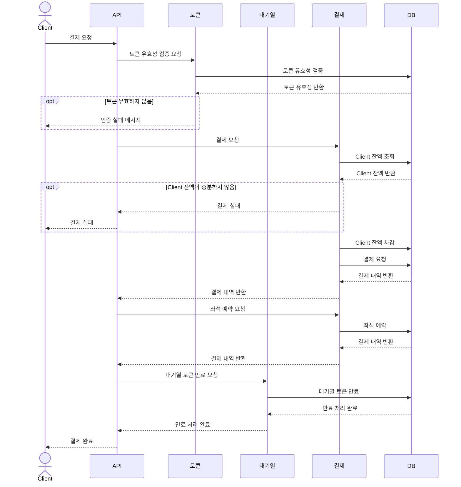

# Sequence diagram

---

## 유저 토큰 발급 API

---

      주요 유저 대기열 토큰 기능
      • 서비스를 이용할 토큰을 발급받는 API를 작성합니다.
      • 토큰은 유저의 UUID 와 해당 유저의 대기열을 관리할 수 있는 정보 ( 대기 순서 or 잔여 시간 등 ) 를 포함합니다.
      • 이후 모든 API 는 위 토큰을 이용해 대기열 검증을 통과해야 이용 가능합니다.
      | 기본적으로 폴링으로 본인의 대기열을 확인한다고 가정하며, 다른 방안 또한 고려해보고 구현해 볼 수 있습니다.

## 대기열 스케줄러

---

## 대기열 정보 조회 API

---

## 예약 가능 날짜,좌석 조회 API

---

	기본 예약 가능 날짜 / 좌석 API
	• 예약가능한 날짜와 해당 날짜의 좌석을 조회하는 API 를 각각 작성합니다.
	• 예약 가능한 날짜 목록을 조회할 수 있습니다.
	• 날짜 정보를 입력받아 예약가능한 좌석정보를 조회할 수 있습니다.
      좌석 정보는 1 ~ 50 까지의 좌석번호로 관리됩니다.

### 예약 가능 날짜 조회 API

### 예약 가능 좌석 조회 API

## 잔액 충전 / 조회 API

---
      기본 잔액 충전 / 조회 API
      • 결제에 사용될 금액을 API 를 통해 충전하는 API 를 작성합니다.
      • 사용자 식별자 및 충전할 금액을 받아 잔액을 충전합니다.
      • 사용자 식별자를 통해 해당 사용자의 잔액을 조회합니다.
### 잔액 충전 API

### 잔액 조회 API

## 좌석 예약 API

## 결제 API

---
      주요 결제 API
      • 결제 처리하고 결제 내역을 생성하는 API 를 작성합니다.
      • 결제가 완료되면 해당 좌석의 소유권을 유저에게 배정하고 대기열 토큰을 만료시킵니다.

