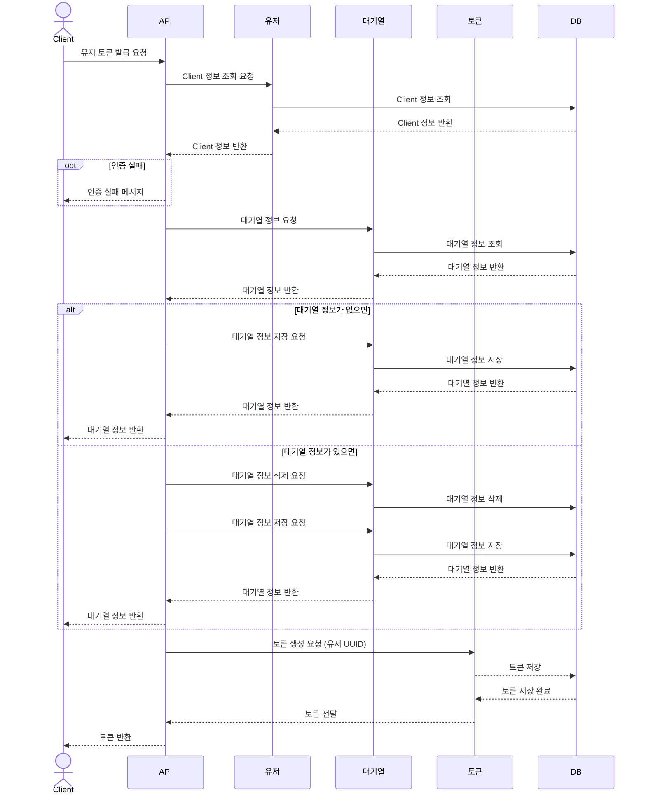
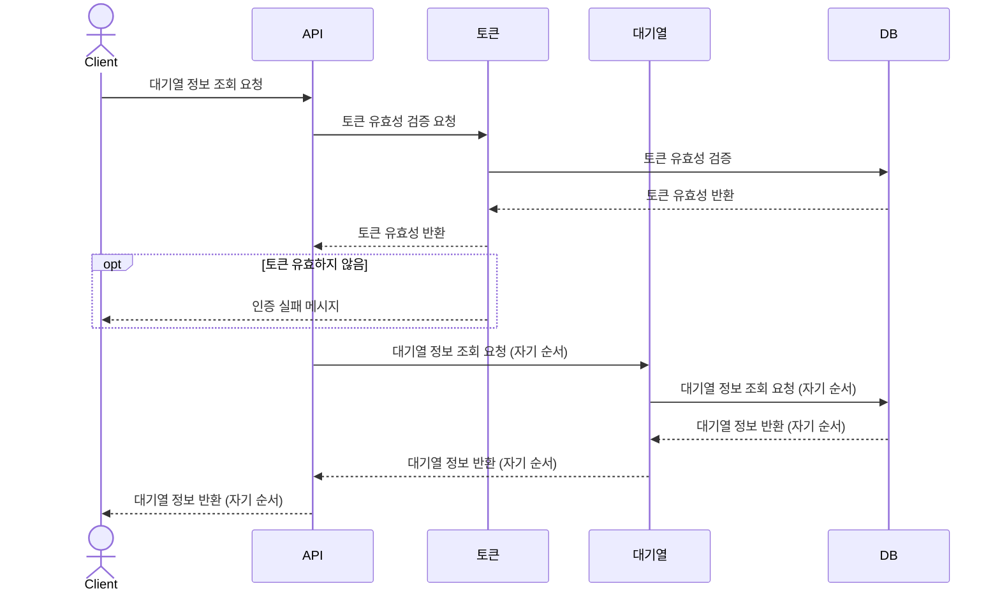
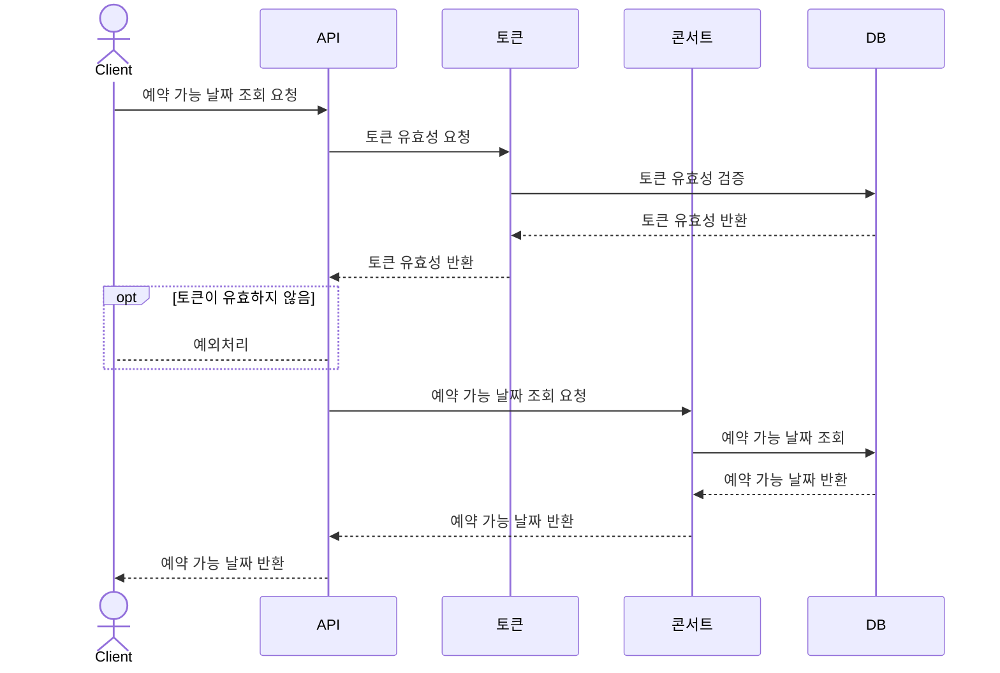
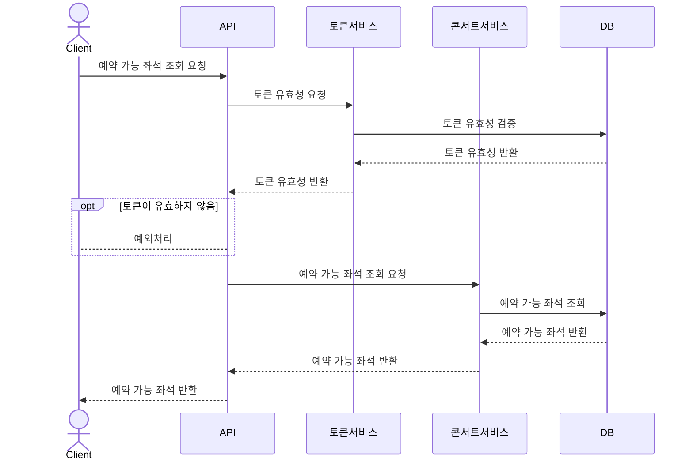
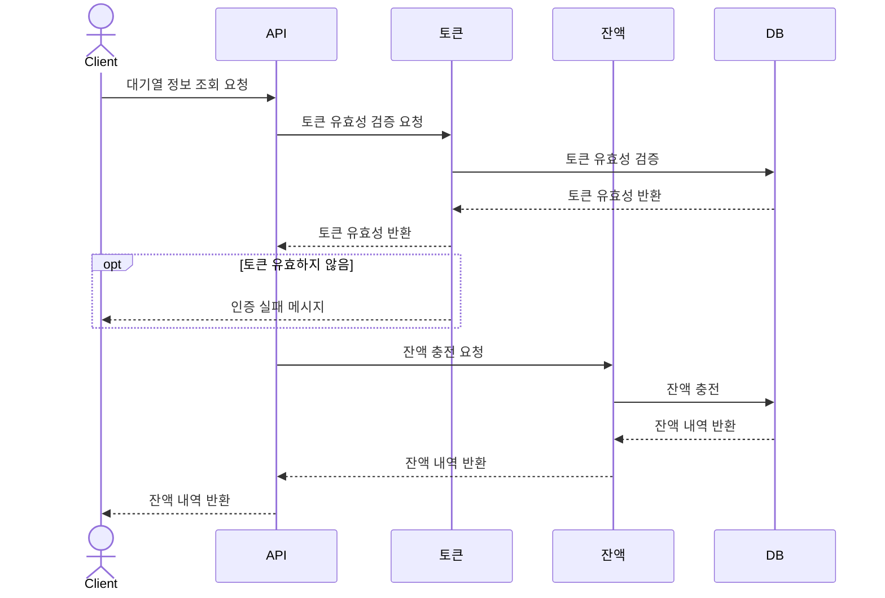
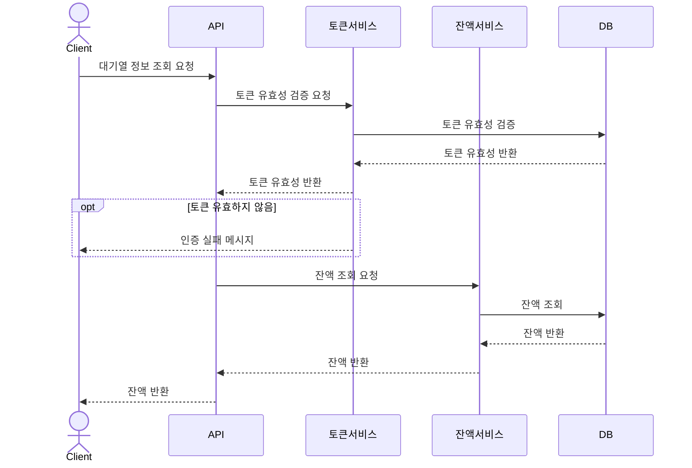
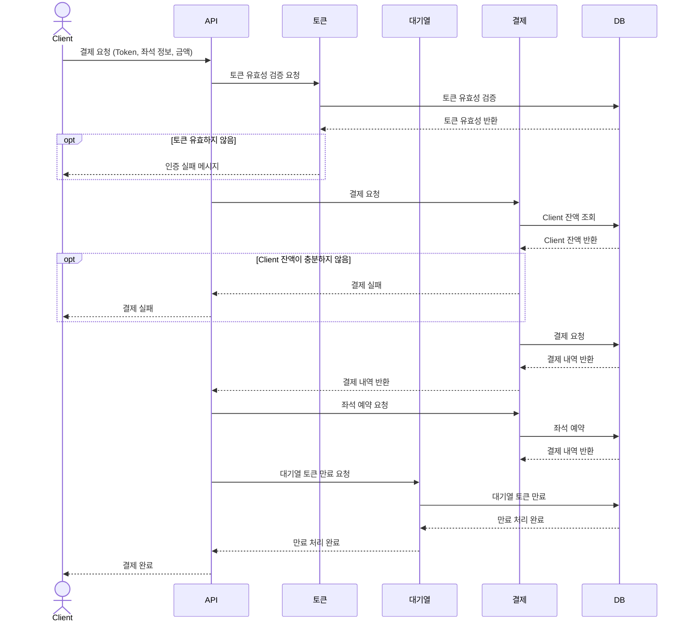

# sequence diagram

---

## 유저 토큰 발급 API

### API Specs
1. 주요 유저 대기열 토큰 기능  
   • 서비스를 이용할 토큰을 발급받는 API를 작성합니다.  
   • 토큰은 유저의 UUID 와 해당 유저의 대기열을 관리할 수 있는 정보 ( 대기 순서 or 잔여 시간 등 ) 를 포함합니다.  
   • 이후 모든 API 는 위 토큰을 이용해 대기열 검증을 통과해야 이용 가능합니다.  
   | 기본적으로 폴링으로 본인의 대기열을 확인한다고 가정하며, 다른 방안 또한 고려해보고 구현해 볼 수 있습니다.  

## 대기열 정보 조회 API

---

## 예약 가능 날짜,좌석 조회 API

---

### 예약 가능 날짜 조회 API

### 예약 가능 좌석 조회 API

## 잔액 충전 / 조회 API

---

### 잔액 충전 API

### 잔액 조회 API

## 결제 API

---

